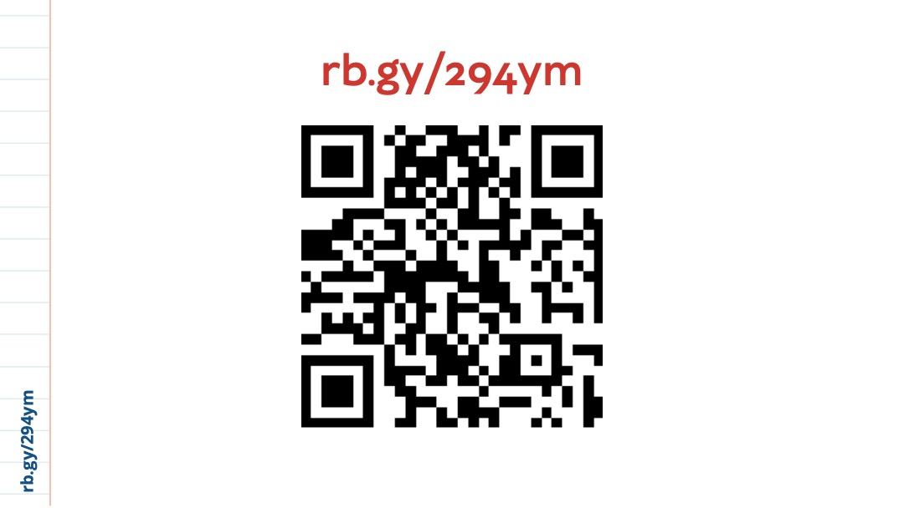
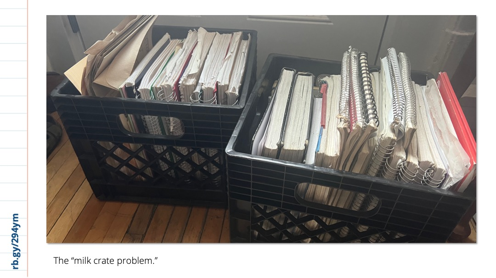
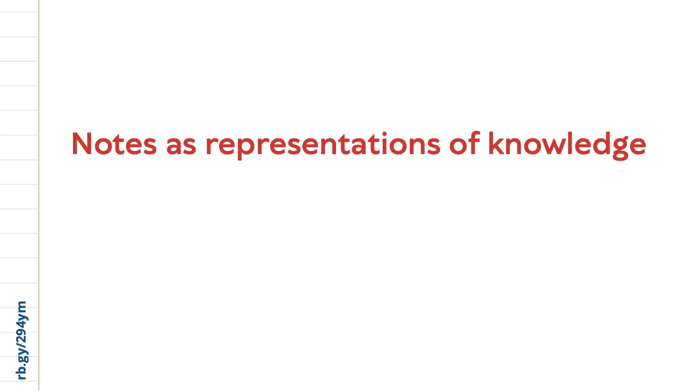
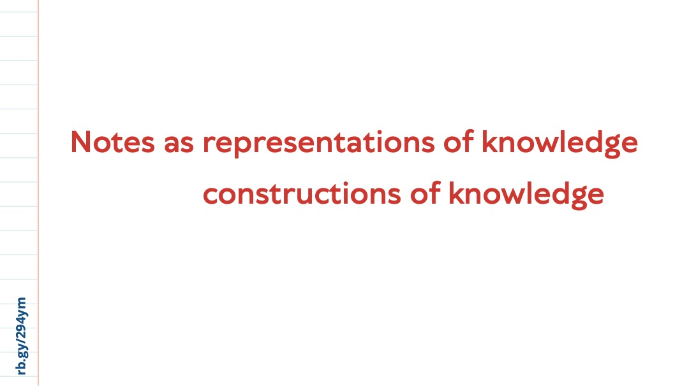
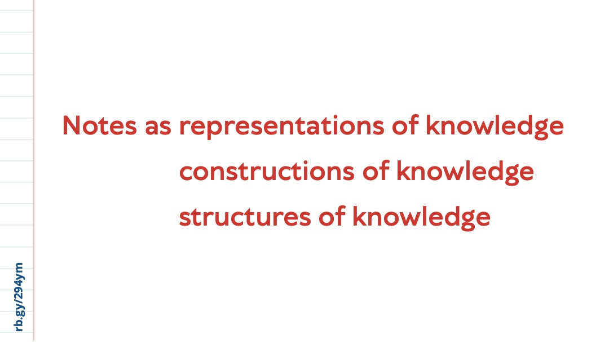
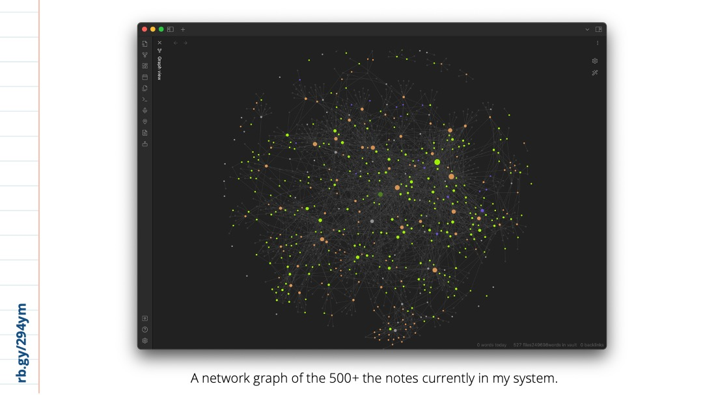

*An exploration of everyday academic methods*

[Kit Chokly](https://kitchokly.com), PhD Student in Communication Studies, McGill University
Canadian Communication Association Conference, June 1, 2023

[Read paper this talk is based on here.](Introduction.md)

[Download the Powerpoint slides here.]()

---

## Transcript

Hi everyone, I’m Kit. My research surrounds transgender media studies—but today, I’m going to be talking about something which has become a bit of a side interest for me as I move through grad school: that is, note-taking systems.

Before we dig in, though, I want to share this link—it’s a website which includes the transcript for this talk and alt text for the images I show here today, as well as the original paper this talk draws from. This site is also built using the same structure as the note-taking system I’m going to be talking about today, so you’re welcome to visit the site and check it out for yourself if you’d like.

Just under a year ago, I moved to Tiohtià:ke to begin my PhD at McGill. And as I packed up my small apartment to move into my new, even smaller apartment, I came across these: the notes I had taken over my time at Carleton, where I studied Communication in both my bachelor’s and master’s degrees. And despite already being conveniently in boxes, I couldn’t help but leaf through them.

I have little recollection of taking most of these notes, but going through them I found evidence of my own struggle to understand concepts I now use regularly, as well as explorations of ideas I have since moved away from. But a lot of them also included a lot of interesting things I had completely forgotten about. There were notes on fascinating articles I hardly remember reading, details about concepts which would have been *so* useful in that thesis I had just submitted, and even somewhat promising research questions I had written to my future self. Despite the fact I would have to drag them up to my new third-floor walk-up, I decided they would have to come with me in my move.

They also got me thinking, though. I had been meticulous in my note-*taking*, and this had served me quite well in my classes and research at the time. But once those projects had ended, it seems like the use of these notes had ended too: the notebook was closed and stored in a milk crate. And this doesn’t even consider the many half-baked ideas I have jotted on post-its or typed into Word files and note-taking apps over the years. There was evidently a disconnect between taking these notes and using them as I moved forward into new projects—a problem that seemed especially poignant as I was starting a PhD.

