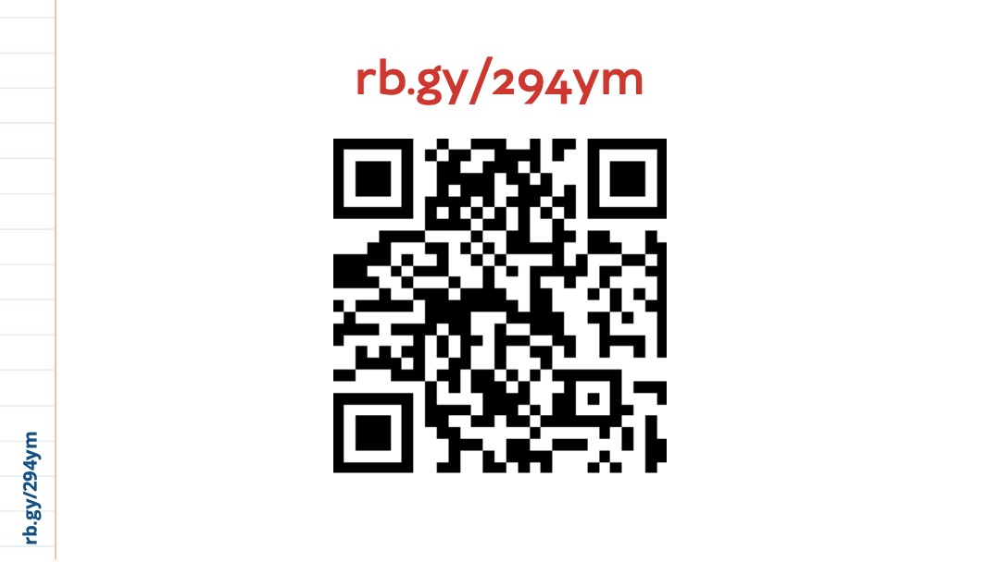
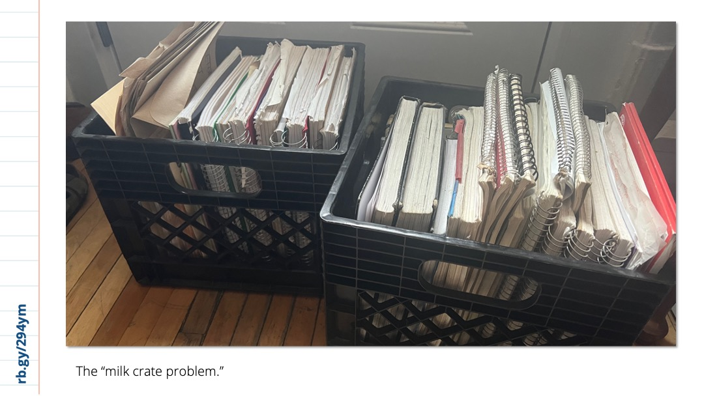
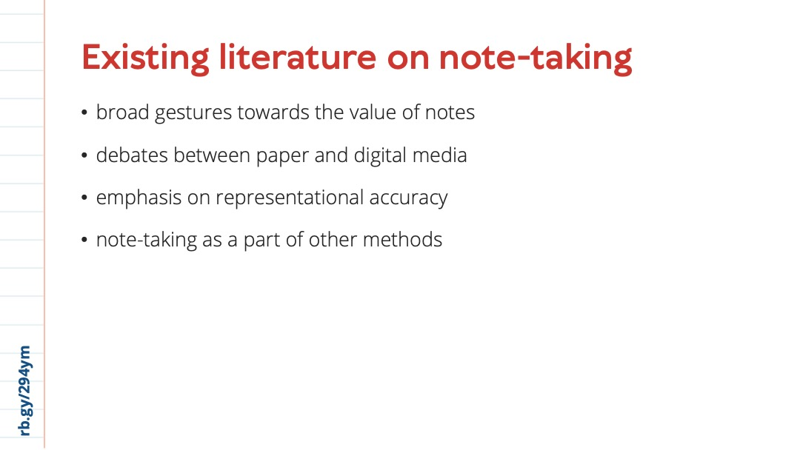
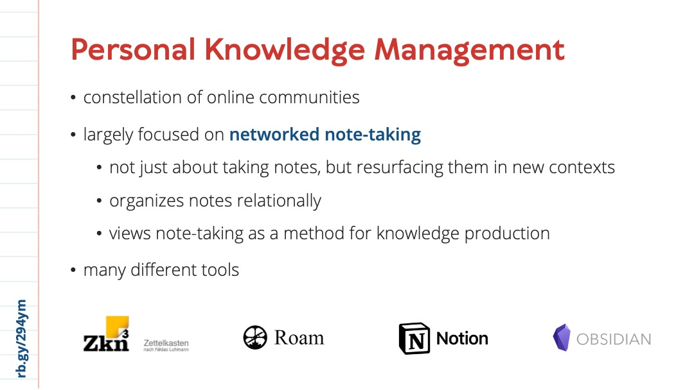
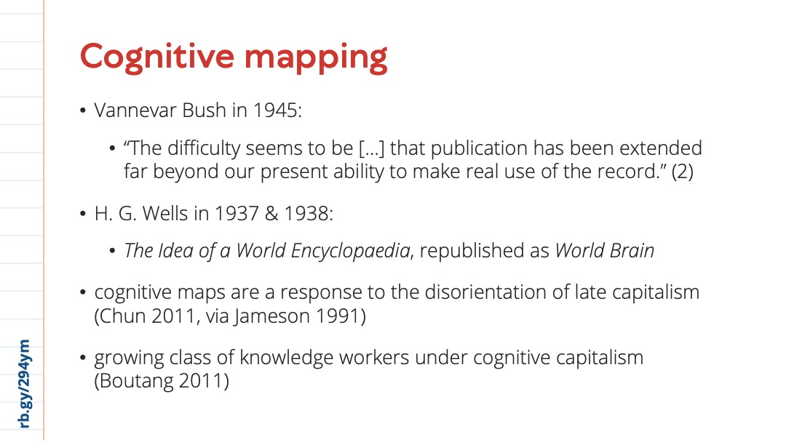
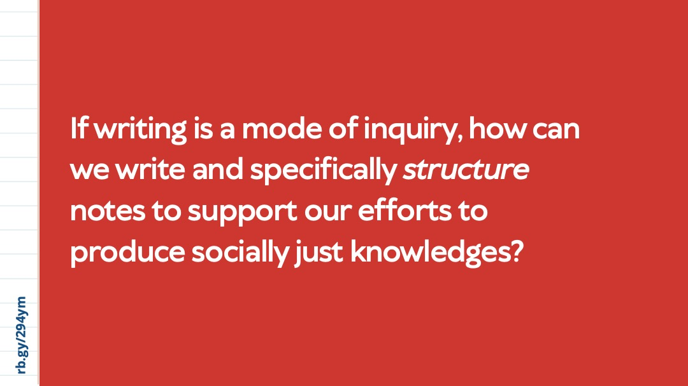
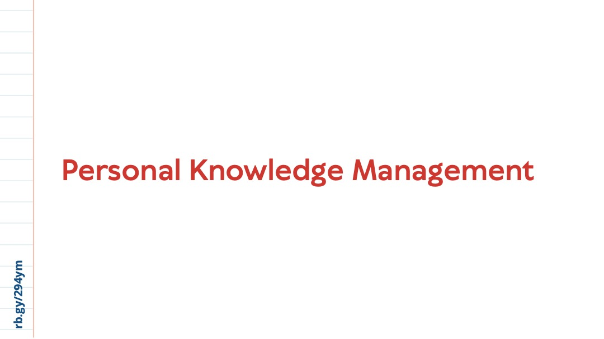
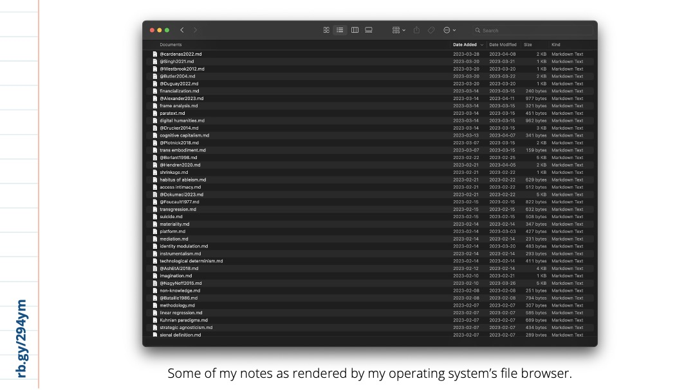
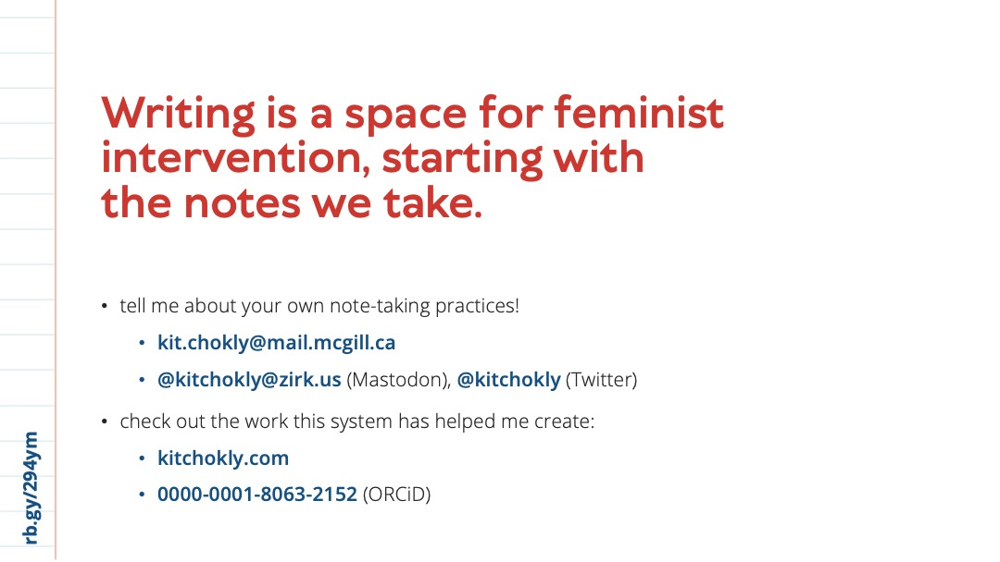
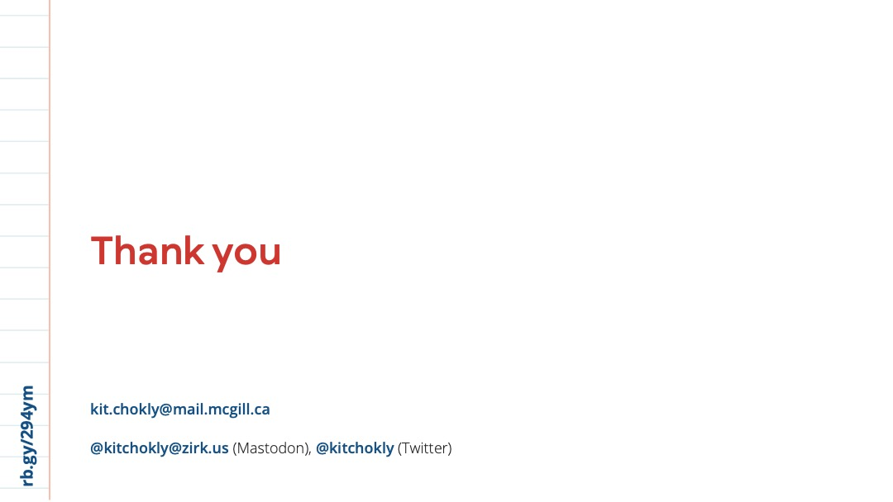

[Kit Chokly](https://kitchokly.com), PhD Student in Communication Studies, McGill University

kit.chokly@mail.mcgill.ca

[@kitchokly@zirk.us](https://zirk.us/@kitchokly) (Mastodon), [@kitchokly](https://twitter.com/kitchokly) (Twitter)

**[Read paper this talk is based on here.](Introduction.md)**

---

## Slides, alt-text, & transcript

**Alt-text**

Slide 1: A red title slide reading “Developing a feminist note-taking system: An exploration of everyday academic methods, Kit Chokly, PhD Student at McGill University, CCA Annual Conference 2023.” The left margin is designed to look like lined paper and has a short URL “rb.gy/294ym” in the corner.

**Transcript**

Hi everyone, I’m Kit. My research explores trans uses of media technologies to challenge normative representations of trans experiences. This isn't what I'm going to be talking about today, though—actually, I'm going to be focusing on some of my very early experiments with the everyday methods that I'm using to do this research, specifically, the idea of note-taking as a feminist method.

**Alt-text**

Slide 2: A white slide with a large QR code and the same link, rb.gy/294ym at the top.

**Transcript**

Before we dig in, though, I want to share this link—it’s a website which includes these slides, a transcript, alt text, my sources, as well as the original paper this talk draws from. This site is also built using the same structure as the note-taking system I’m going to be talking about, so if you'd like to see it in practice, you’re welcome to check it out. The URL is rb.gy/294ym —if anyone needs me to read it again, just let me know. It's also printed in the left margin of every slide.

**Alt-text**

Slide 3: An image of two black milk crates, stuffed full of notebooks. The caption reads “The ‘milk crate problem.’”

**Transcript**

So. Just under a year ago, I moved cities to begin my PhD at McGill. And as I was packing, I came across these milk crates, stuffed full of the notes I had taken in my time studying for my bachelor’s and master’s degrees. And despite already being conveniently in boxes, I couldn’t help but leaf through them.

I have little recollection of taking most of these notes. For many of them, that’s okay—I don’t really need to revisit my undergraduate confusion, to be honest. But a lot of them also included things I wish had remembered. There were notes on fascinating articles I hardly remember reading, details about concepts which could have addressed some of the gaps in that thesis I had just submitted, and even some maybe promising research questions I had written to my future self. So despite having to drag them up to my new third-floor walk-up, I decided these milk crates would have to come with me.

They also got me thinking, though. I had been meticulous in my note-taking, and this had served me quite well in my classes and research at the time. But once those projects had ended, it seemed like the use of these notes had ended too: the notebook was closed and filed away, only to be reviewed by happenstance. And these are just the notes I saved. There was evidently a disconnect between taking these notes and using them as I moved forward into new projects—a problem that seemed especially important to address with the start of a new degree and striving to expand the diversity of my knowledge.

So I started looking into literature on academic note-taking and retrieval practices—and was surprised to find that no one was really talking about my problem. Rather, this literature took for granted that notes would be useful and used, usually as an aspect of other methods like ethnography or interviews. What they did do, though, was discuss notes in two related ways which I found helpful to rethink my own note-taking practices. And this was notes as representations of knowledge and as its construction.

**Alt-text**

Slide 4: Red text on a white background reading “Notes as representations of knowledge.”

**Transcript**

As representations of knowledge, note-taking is understood as a support for long-term memory and a stand-in for the object being observed. And as a stand-in, notes need to be accurate, with some writers even encouraging researchers to adopt multimedia “notes” as supplements for writing ([Gimenez & Pinel, 2013](References/Gimenez%20&%20Pinel,%202013.md); [Tinny & Nhamo, 2013](References/Tinny%20&%20Nhamo,%202013.md)). While accuracy is important, much more of this literature emphasized how being overly focused on representation risks ignoring the role of the note-taker in the notes they write, where even deciding what is noteworthy plays a role in representation ([Gimenez & Pinel, 2013](References/Gimenez%20&%20Pinel,%202013.md)).

**Alt-text**

Slide 5: Red text on a white background reading “Notes as representations of knowledge,” a line break, and then “constructions of knowledge” in alignment with the first line.

**Transcript**

This is where the idea of notes as a constructions of knowledge come in. These approaches often draw on feminist epistemologies to emphasize how these constructions are shaped through power. And this is where I began to draw connections with my own work and how note-taking might shape this work moving forward.

**Alt-text**

Slide 6: A red slide with white text reading: “We can seize upon the textual violence inscribed in the transsexual body and turn it into a reconstructive force. … I suggest constituting transsexuals … as a genre-a set of embodied texts whose potential for productive disruption of structured sexualities and spectra of desire has yet to be explored. Stone 1992, 165, emphasis added.”

**Transcript**

So for example, [Sandy Stone’s 1992](References/Stone,%201992.md) essay The Empire Strikes Back: A Posttranssexual Manifesto is generally cited as one of the foundational texts of transgender studies. And this is because she connects trans existence to institutional knowledge production. She argues that the exclusion of trans perspectives as legitimate sources of knowledge has led to a “textual violence inscribed in the transsexual body” which denies our existence entirely. In response, she urges that we can “seize upon \[this\] textual violence” and “turn it into a reconstructive force,” to constitute transsexuals “as a genre-set of embodied texts” (165, emphasis added) which can expand on the discursive realm of what we consider legitimate knowledge on gender and sexuality.

**Alt-text**

Slide 7: Identical to Slide 5, with red text on a white background reading “Notes as representations of knowledge,” a line break, and then “constructions of knowledge” in alignment with the first line.

**Transcript**

And this approach to “embodied textuality” is echoed variously across queer, trans, and feminist epistemologies, asserting that research and researchers, like all aspects of knowledge production, are always already entangled ([Gunaratnam & Hamilton, 2017](References/Gunaratnam%20&%20Hamilton,%202017.md)). While she doesn’t talk specifically about note-taking, I find [Anna Gibb’s (2007)](References/Gibbs,%202007.md) work on writing as method to be especially useful here, as she argues that writing puts the writer “in conversation with the world, with other writing, and, reflexively, with itself” (p. 224), making it “a mode of inquiry in its own right” (p. 222).

Note-taking, then, can be useful to consider as a feminist method—something which we already see reflected in feminist work using autoethnography, poetics, and vignettes, for example.

**Alt-text**

Slide 8: Red text on a white background reading “Notes as representations of knowledge,” a line break, “constructions of knowledge,” and now also “structures of knowledge” in alignment with the first line.

**Transcript**

But reflecting on my milk crate problem, I think we need to go further. It’s not just the writer who contributes to the construction of knowledge, but as Gibbs writes, also the ways that writing is put into relation to other thoughts, ideas, and observations. And these relations are themselves always structured. Consider how archives don’t just document the past but actively shape its construction through the way they store and present information (([Schwartz & Cook, 2002](References/Schwartz%20&%20Cook,%202002.md)). The placement of one record next to another offers evidence of a shared context and begins to piece together a story which is as much formed by what is present, where, as what is not present at all ([Gitelman, 2014](References/Gitelman,%202014.md); [Vismann, 2008](References/Vismann,%202008.md)).

So while there has been work emphasizing the role of structure in knowledge production, it usually focuses on large institutions like museums and archives rather than the writing-as-method which Gibbs talks about. But my milk crates are, in some ways, a personal archive which suffers from some of the same problems: by organizing notes by often arbitrary categories like course codes, fields, readings, dates, and projects, this archive shapes how these notes are accessed and how they are able to relate to each other—or not at all.

**Alt-text**

Slide 9: White text on a red background reading “If writing is a mode of inquiry, how can we write and specifically structure notes to support our efforts to produce socially just knowledges?”

**Transcript**

So this leads me to ask: If writing is a mode of inquiry, how can we write and specifically structure notes to support our efforts to produce socially just knowledges?

Although I didn’t find much about the practical methods for note structuring in academic literature, I did find a lot of useful information online in a collection of communities loosely grouped under “PKM,” or Personal Knowledge Management.

**Alt-text**

Slide 10: Red text on a white background reading “Personal Knowledge Management”.

**Transcript**

These spaces largely focus on what I’ve been calling networked note-taking systems, which rethink notes from being one-off documents to interconnected writing. They emphasize that notes should be useful beyond the original context that they were made, recognizing how traditional note-taking requires already knowing that a note exists and could be useful in a particular context. Instead, networked note-taking resurfaces relevant notes through their linked connections to others. This means that you encounter notes not just when you already remember that they’re there, but also when you don’t—allowing for new and unexpected connections to be made across contexts, helping produce new articulations of knowledge.

Now, to be clear—I’m suspicious of a lot of the discourses and practices surrounding PKM. They frequently promise individual productivity by freeing users from the apparently contemporary problem of “information overload” through technological means—something I've been trying to think through in a new paper, actually. This productivity-focus and technological solutionism also means PKM fails to consider what kind of knowledge these systems contribute to making or the values which are inevitably baked into them.

But I turn to PKM because a) at the same time, these communities are generally open to sharing practical tools and tips, and b), I see an opportunity for these systems to be used for feminist research practices by recognizing the situated nature of notes, the knowledges they contribute to producing, and the possibility of bringing these knowledges out of externally imposed categories and into new relations. And I find this especially powerful while working in Communication Studies, which often strives and struggles to bridge disciplines and integrates diverse sources of knowledge.

So. I decided to give networked note-taking a shot, trying to build a system which recognizes the role of notes as representations, constructions, and structures of knowledge, all while drawing on some of the practical tools offered by PKM.

**Alt-text**

Slide 11: Red text on a white background reading “Technical needs of the system” with a bulleted list in blue beside it, reading “Free, Active community, Non-proprietary file formats, and Local storage.” Below, red text reads “Guiding ‘nodes’ of the system,” with bullets beside reading “Flatness, Interconnection, Atomicity, and Iteration.”

**Transcript**

The first step of this process was choosing the software to house this system. There is a whole conversation we can be having here about technical systems and software, which is something I hope to dig into in the future. But for now, I knew I wanted something which was free, had an active and supportive community, and used non-proprietary file formats stored locally so that I could pull my notes out of the software at any time with little fuss. This led me to a program called Obsidian, which interfaces human-readable Markdown text files, making them both private and available without the software’s interface if need be.

I then established four rules to guide this system’s shape, which I awkwardly call “nodes” to stress their relationality with each other. These “nodes” are heavily informed by what I’ve learned from PKM communities and can be summed up as flatness, interconnection, atomicity, and iteration. It’s these nodes which I’m going to use to explain some of this system for the short remainder of this talk, starting with flatness.

**Alt-text**

Slide 12: A screenshot of a file browser with a long, illegible list of Markdown files. The caption reads: “Some of my notes as rendered by my operating system’s file browser.”

**Transcript**

So flatness means storing notes in as few containers as necessary. Keeping all related notes in one folder means that you can find your notes through metadata, but also their connection to other notes, rather than externally imposed categories introduced by the folder. I keep notes on concepts, literature, and the research data I collect in the same root folder, regardless of their topic or field, and use naming prefixes to distinguish them quickly—like the @ symbol before my notes on literature, for example. This allows me to easily put them into relation with each other through their location in the network, which is largely how they gain meaning in the system.

This is a screenshot of my notes as rendered by my computer’s file manager rather than Obsidian, which certainly does not look like a network. But within each note are links to others—links which Obsidian then renders for me visually.

**Alt-text**

Slide 13: A screenshot of a network graph which shows a highlighted node in blue and its connections to many other nodes in the network. Nodes which are not directly connected are faded out of focus. Caption reads “Some of my notes as rendered by Obsidian’s graph view.”

**Transcript**

And this is a screenshot of what that looks like. This network graph brings me to the node of interconnection, where notes are linked liberally. This is the strength of this method; it builds the network which allows notes to be resurfaced both flexibly and contextually, as well as make new connections across them.

So here, the highlighted note is titled “affordance,” and each blue line represents its connection to another note. Hovering over one note here highlights its connections to others, allowing me to view a trail of the notes I have already connected from a macroscopic perspective.

**Alt-text**

Slide 14: Three screenshots of three notes, each with white text on a dark background. Some of the text is made up of blue links. The third note has an unidentifiable AI-generated image. The caption for the first reads “Concept note (“affordance”)”, the second reads “Literature note (Introduction to Arseli Dokumanci’s Activist Affordances)”, and the third reads “Research data note (an instance of an AI-generated image posted to a trans subreddit)”.

**Transcript**

These interconnections occur within the text of the note. These are the four different types of notes within my system, three of which are viewed here: a concept note, a literature note, a research data note, and a journal note, which I am not sharing with you all today! I use these examples not for what they're saying here—these are still notes, not publishable work—but for the way they are structured: namely, the links in blue which connect these notes through their text, kind of like Wikipedia. Being able to link between these four different types of notes allows me to build relationships between ideas, objects, and sources as I write and reread them.

One problem I ran into while building this system was deciding what makes up a note: when everything is linked, it can be hard to know where to draw the boundary around one object or idea. This problem brings me to what [Andy Matuschak (n.d.)](References/Matuschak,%20nd-b.md) calls atomic notes, where notes are broken up as much as possible without losing their context. This doesn’t mean making small notes, necessarily, but instead ensuring that they can stand alone while staying flexible enough to meaningfully link to others. For example, a lot of the note on the concept of affordance here draws directly from my notes on Dokumanci’s book chapter, the note in the middle, which I separated to bring in other related literature on the concept. This then allows me to trace those relationships through the network graph or…

**Alt-text**

Slide 15: A screenshot of a table, which shows the image from the third note in the previous slide alongside many others, as well as other columns like “Title” “Subreddit” and “Notes.” The caption reads “A table which draws directly from individual note contents for comparison.”

**Transcript**

…even a table like this, this one here integrating my individual research data notes on a particular project into one frame. This lets me see these objects and the things I've written about them within each note, next to other, while still linking to relevant concepts and literature.

My last node is iteration. Since these notes are situated with my own experiences, they’re always open to change as I encounter new ideas and my own thinking changes. They're less of archive and more of an actual research process. Reviewing notes each time they surface in relation to others can help add new sources to an idea; divide it into several new, atomic notes; or link it to others. Iteration also means rethinking the system itself as necessary to adjust what works and what doesn’t.

**Alt-text**

Slide 16: A zoomed out version of the network graph, which looks like a large orb full of green and orange dots. The caption reads “A network graph of the 500+ notes currently in my system.”

**Transcript**

I’ve been using this system for just under a year now and I've found its really helped me record and reflect on the many concepts and sources I’ve encountered over this time, my own relation to them, and their relation to each other. It's also helped me connect things I would have otherwise missed which I think helps make my research more thorough and my citation practices more diverse.

The biggest change I’ve noticed, though, is how this system has shifted my attitude towards writing. I’m a bit ashamed to say that previously, I subconsciously viewed writing as largely instrumental part of what I do which only really mattered at the final stages of a project. Now I see it as foundational to all stages of my research process, not just for the things I produce, but for my own thinking—and therefore important to do with care and intention, even as notes.

**Alt-text**

Slide 17: Large red text on a white background reading “Thank you,” follow by smaller text in blue reading “kit.chokly@mail.mcgill.ca, @kitchokly@zirk.us (Mastodon), @kitchokly (Twitter).”

**Transcript**

Like any method, adopting a networked note-taking system not a guarantee for more socially just research, and I have a lot of questions around the way that data visualization, user interfaces, and software plays a role here, not to mention my curiosity about the communities which have emerged around note-taking tools and technologies. But adopting this system has also given me room to reflect on my own writing and citation practices, not just in the final draft of an article, but in the notes I use to support this work. I’m also curious to explore how such a system might be support or preclude collaborative writing practices. For now, I’m going to leave it at that—and please, if you are open to sharing your own note-taking strategies, I would love to hear them. And, of course, thank you for listening to mine.
