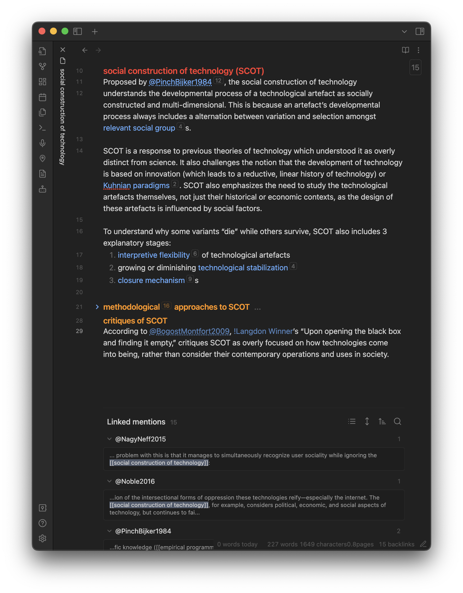

## Link notes liberally

Refusing to rely on containers or long-winded details to organize and contextualize our notes means we must instead turn to the use of *other* notes to function in these capacities. This means linking notes liberally to create flexible and perhaps even novel contexts for ideas and concepts (see Figure 3). As [Matuschak (n.d.-c)](References/Matuschak,%20nd-c.md) writes, "If we push ourselves to add lots of links between our notes, that makes us think expansively about what other concepts might be related to what we’re thinking about" (para. 1). Not only does this mean our notes become non-hierarchical and non-linear, but it also enables a profound creativity in our writing which can lead us to unexpected places for research. This creativity is critical for social justice-oriented research. As [TallBear (2014)](References/TallBear,%202014.md) argues:

 > 
 > It is also helpful to think creatively about the research process as a relationship-building process, as a professional networking process with colleagues (not “subjects”), as an opportunity for conversation and sharing of knowledge, not simply data gathering. Research must then be conceived in less linear ways without necessarily knowable goals at the outset. (p. 2)

Here, TallBear is referring to the relations of researchers and other people involved in research, but as [Gibbs (2007)](References/Gibbs,%202007.md) argues, relationships can manifest in our notes, too. Notes are not just for recording observations from the field and literature reviews but also for recording interesting conversations and other nontraditional sources of knowledge. Linking these notes together introduces the validity institutional knowledge requires with the multitude of knowledges it frequent excludes.

The foundation of Luhmann’s system involved finding ways to link notes via analog mean. Markdown, however, is a language which formats plan text and enables linking between files. Simply encasing a text string within square brackets transforms it into a link to any other note within the container which shares the string as its title. This allows us to make a link to another idea within a sentence, much like the links found on Wikipedia.

Figure 3. *A note with links*

*Note.* This brief note offers an overview of a theoretical model with additional key concepts (e.g., relevant social group, Kuhnian paradigm, interpretive flexibility) and literature (e.g., Pinch & Bjiker, 1984; Nagy & Neff, 2015; Noble, 2016) linked through out in blue text or under “Linked mentions,” a list of notes which link to this note (also known as a backlink).

# 

 > 
 > [👈 📖 Four nodes overview](Four%20nodes%20of%20a%20feminist%20note-taking%20methodology.md)

 > 
 > 1. [📖 Atomicity 👉 ](Atomicity.md)
 > 1. [📖 Flatness 👉 ](Flatness.md)
 > 1. 📖 Interconnection
 > 1. [📖 Iteration 👉 ](Iteration.md)
