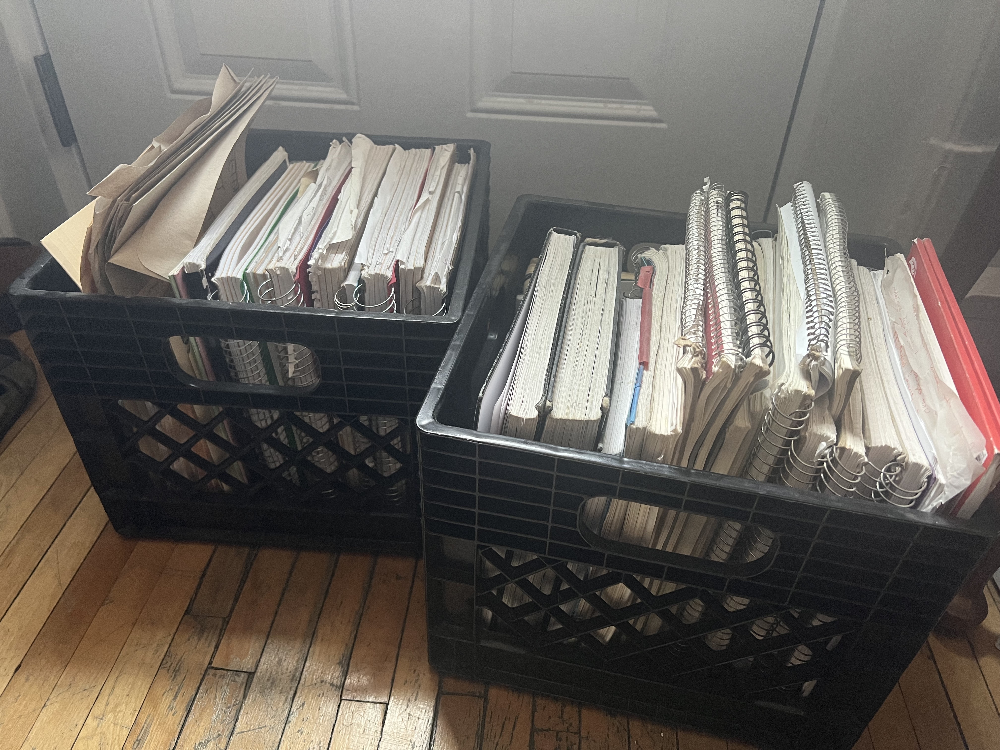

[McGill Feminist Research Colloquium](https://frcmcgill.blogspot.com/p/2023-schedule-and-abstracts.html), April 13, 2023  |   [Kit Chokly](https://kitchokly.com), PhD Student in Communication Studies

*Two of the author’s milk crates stuffed full of notebooks, file folders, and envelopes.* 

# 

 > 
 > Next: [Agenda  👉](Agenda.md)

---

 > 
 > \[!quote\]- Transcript
 > 
 > Hi everyone, my name is Kit and I’m a PhD student in Communication Studies here. Today I’m going to talk about something which has become a bit of a side interest for me over the past year or so, and that’s note-taking as a form of knowledge production.
 > 
 > Throughout my time in graduate school, I’ve had some issues with note-taking. I take notes to help me remember what I learn… but I take so many notes that I kept forgetting about the fact that I took a particular note in the first place. 
 > 
 > So my notes were generally looking like this—a seemingly-organized box of notebooks containing many notes that *could and did* relate to each other, but I was failing to actually make those connections. This meant I was doing a lot of repetitive work and missing entire bodies of knowledge in my research which I had actually already encountered before.
 > 
 > This brought me into researching some of the histories and methodological principles of note-taking. And considering how much of what I’ve found in these spaces emerge from academia’s history of colonialism and today’s always-on productivity culture, I wanted to see if I could take some of these principles while remaining oriented towards social justice.

Read the paper [Developing a feminist note-taking system](Developing%20a%20feminist%20note-taking%20system.md), or click the link with the 📖 icon at the bottom of each page to go directly to the paper’s relevant section, if there is one.

[📖](Introduction.md)
