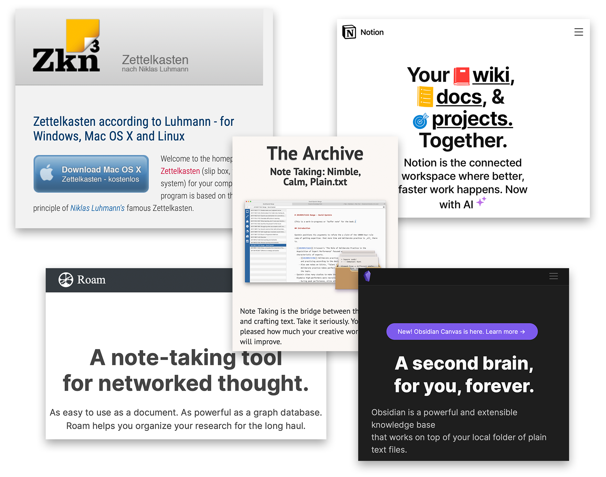

* Constellation of online communities
* Largely focused on [📖 networked note-taking](pa5%20Notes%20as%20structures%20of%20knowledge.md)
  * Not just taking notes, but resurfacing them in new contexts
  * Notes are organized relationally
  * Aims to use notes to produce new knowledges through their connections
* Many different systems and tools being used
  * Zettelkasten, Notion, The Archive, Roam, Obsidian…

# 

 > 
 > Next: [📽️ A growing market](pr5%20A%20growing%20market.md)

---

 > 
 > \[!quote\]- Transcript
 > 
 > Where I *did* find this information was online, in a constellation of communities loosely grouped under the moniker PKM, or Personal Knowledge Management. PKM is a variety of systematic approaches to, well, managing one’s own knowledge: the stacks of paper like those found in my milk crates, but also those found across various media types, reflections from one’s own journals, and even notes on conversations with others.
 > 
 > PKM can be quite broad, but it’s primary focus is on what I called networked note-taking systems. These systems don’t just focus on the techniques used to *take* notes, but also their storage structure and the way this structure works to *resurface these notes* into new contexts.
 > 
 > Usually, notes are organized by the context or date that they were \_taken—\_filed into a documents folder or notebook tabbed by subject—but not necessarily when they will be *used.* Even with digital search tools, this still means that notes are resurfaced purposefully: for search to work, you have to remember that something within this note exists so you can start looking for it. *In addition to harnessing search*, networked note-taking systems are designed to resurface relevant notes not just when you already remember they’re already there, but also when you don’t—allowing for new and unexpected connections to be made across contexts and fields, effectively using notes to *produce new knowledges*.
 > 
 > This usually involves a centralized database which holds these notes and links them together by relevance, creating a network of personal knowledge. Many of the conversations in PKM spaces pop up around the tools used to make this network. Some stick to pen-and-paper methods, often inspired by the index card “zettelkasten” system used by 20th century German sociologist Niklas Luhmann which followed similar principles. Others make digital versions of this system using specialized software or new systems entirely.
