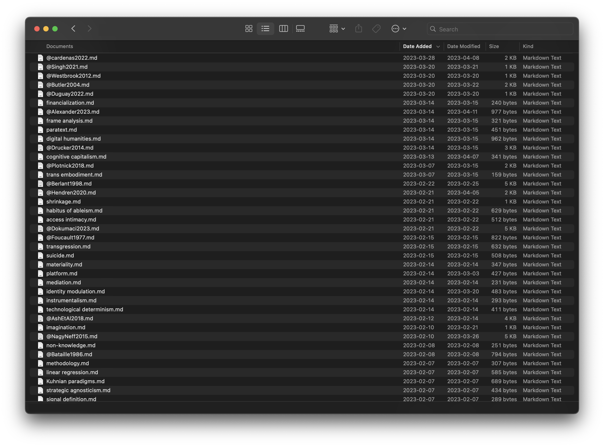

## [📖 Flatness means storing notes in as few containers necessary](pa6b%20Flatness.md)

* Folders/notebooks/milk crates can silo notes into arbitrary structures
* Notes can still be found through search when you know what you’re looking for
* But they are also resurfaced through contextual relations when you don’t

# 

 > 
 > Next: [📽️ 2. Interconnection](pr9b%20Interconnection.md)

---

 > 
 > \[!quote\]- Transcript
 > 
 > The first node of this system is flatness. This means storing notes in as few containers necessary. Like my notebooks and milk crates, folders can divide ideas and notes from each other and silo them into arbitrary structures. Like a personal archive, these folders don’t just document previous work and ideas: They actively shape the meaning and purpose of this work by the way they store and present different information ([Schwartz & Cook, 2002](References/Schwartz%20&%20Cook,%202002.md)). The organization of information is part of the very production of knowledge—be it within the fonds of an archive or the My Documents folder on a personal computer ([Gitelman, 2014](References/Gitelman,%202014.md)).
 > 
 > Using folders to purposefully separate certain notes from others *can* be advantageous—but keeping notes in one folder means that you *find your notes through their relations to others, rather than externally imposed categories introduced by containers.* I keep notes on concepts, literature, and data in one folder, and use naming prefixes to distinguish them—like the @ symbol before notes on specific pieces of literature.
 > 
 > This is a screenshot as rendered by my computer’s file manager rather than Obsidian. While I do use some folders to purposefully separate some notes, like journal entries, all notes on literature and ideas are included in the same root folder regardless of their topic or field. This means that I rely on their interconnections to encounter then, rather than their organization into folders.
