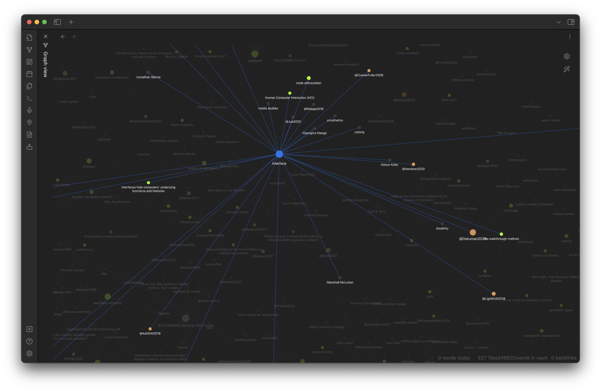

 > 
 > [rb.gy/294ym](https://rb.gy/294ym)

# 

## [📖 Atomicity means breaking notes up as much as possible.](pa6a%20Atomicity.md)

* Dividing ideas into their own notes makes them easier to meaningfully link to other concepts ([Tietze, 2013](References/Tietze,%202013.md))
* Retain links to sources

# 

 > 
 > Next: [📽️ 4. Iteration](pr9d%20Iteration.md)

---

 > 
 > \[!quote\]- Transcript
 > 
 > What makes up a note? Atomicity means breaking notes up as much as possible. By dividing ideas, events, and observations into their own notes, notes are much easier to meaningfully link to other concepts.
 > 
 > This means taking core concepts which I pull from readings or observations and bringing them into their own notes. I keep them linked to their source, but this means that I can also bring in other authors’ perspectives on these concepts. I do something similar with my research observations, where each object has its own note, but themes are their own separate notes to help find commonalities with other objects and literature.
 > 
 > This is a screenshot of some of my notes rendered as a network graph. The highlighted node is a note titled “interface” and each line represents a link to another note. The colour of each node represents the type of note it is—green are ideas, while orange are sources, while its size represents the number of words within a note. Hovering over a node highlights its connections to others, allowing me to view a trail of the notes I have already connected from a macroscopic perspective.
